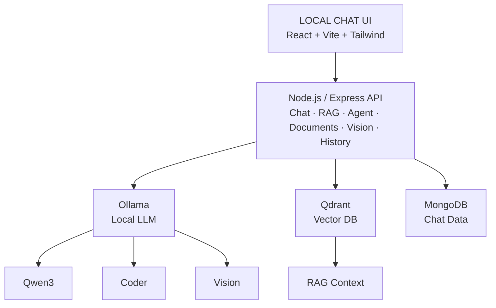
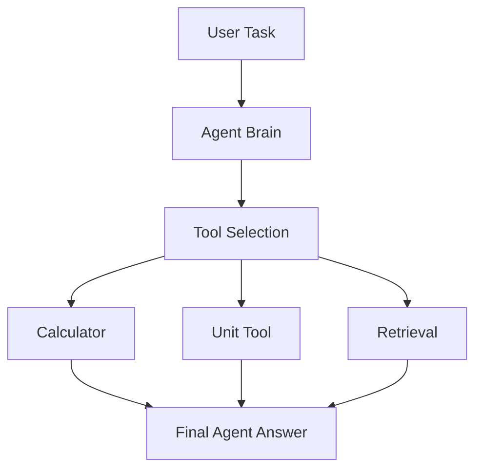
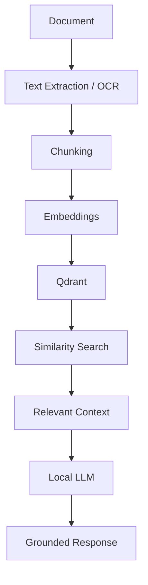
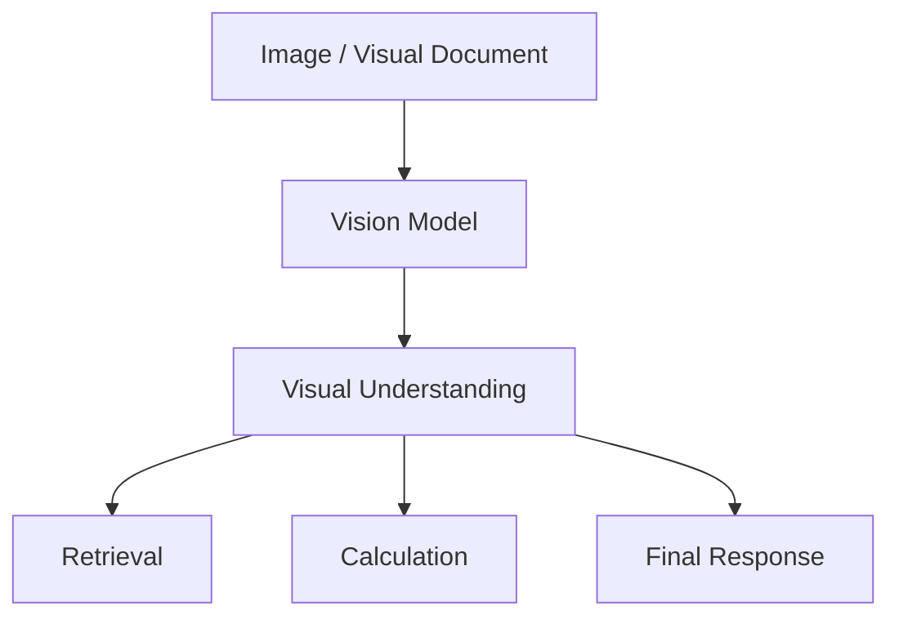
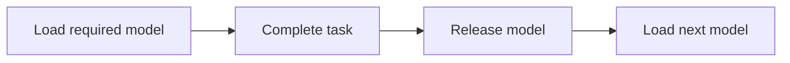
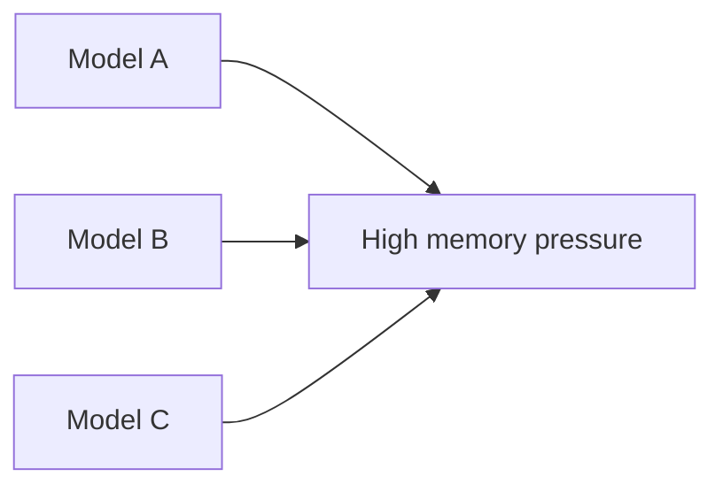

# 🧠 Local Chat

<p align="center">
  <strong>Sovereign, Local-First AI Workbench</strong><br>
  Run open-weight AI models, RAG, document analysis, vision, and agentic tools on your own infrastructure.
</p>

<p align="center">
  
  
  
  
  
</p>

<p align="center">
  <em>Private data stays inside your environment instead of being sent to a public AI API.</em>
</p>

---

## ✨ What is Local Chat?

Local Chat is a full-stack AI workbench designed for local and on-premise AI workloads.

It combines:

- 🧠 Local open-weight LLMs through **Ollama**
- 📚 RAG and Knowledge Base search through **Qdrant**
- 📄 Local document processing and retrieval
- 🤖 An **Agent mode** with tool execution
- 🧮 Calculator and unit-conversion tools
- 👁️ Vision-capable model support
- 💬 Persistent conversations with **MongoDB**
- ⚡ Lazy model loading for resource-constrained machines
- 🌐 Private LAN access for demonstrations and internal deployments
- 🎨 A custom React interface built specifically for the project

The project is intended for confidential technical, engineering, research, and enterprise environments where keeping data under local control is important.

---

## 🖥️ Architecture



### Request modes

**Normal Chat**
```
User → Backend → Local LLM → Response
```

**Knowledge Base**
```
User → Query → Qdrant → Relevant Context → Local LLM → Response
```

**Agent**
```
User → Agent Brain → Tool Selection → Tool Execution → Final Response
```

---

## 🚀 Setup Guide

### 1. Prerequisites

Install the following before starting:

| Software | Recommended |
|---|---|
| Node.js | 20+ |
| npm | Latest |
| Ollama | Latest |
| MongoDB | 8+ |
| Qdrant | Latest |
| Git | Latest |
| Docker | Optional |

> **Recommended:** macOS/Linux with at least 16 GB RAM. Larger models require additional memory.

### 2. Clone the project

```bash
git clone <YOUR_REPOSITORY_URL>
cd <PROJECT_DIRECTORY>
```

If the project uses separate frontend and backend directories:

```bash
cd frontend
npm install

cd ../backend
npm install
```

### 🧠 3. Install and configure Ollama

Install Ollama and verify it:

```bash
ollama --version
```

Start the Ollama server if required:

```bash
ollama serve
```

Verify the API:

```bash
curl http://localhost:11434/api/tags
```

**Recommended models**

| Purpose | Command |
|---|---|
| Agent / General model | `ollama pull qwen3:8b` |
| Coding model | `ollama pull qwen2.5-coder:7b` |
| Vision model | `ollama pull qwen2.5vl:7b` |
| Embedding model | `ollama pull nomic-embed-text` |

Check installed models:

```bash
ollama list
```

Check currently loaded models:

```bash
ollama ps
```

> **Resource tip:** Do not keep multiple large models loaded on a 16 GB machine. Load the model required for a task and release it before loading another large model when possible.

### 🗄️ 4. MongoDB setup

Local Chat uses MongoDB for application data such as chat history and other persistent metadata.

Verify MongoDB:

```bash
mongosh
```

Example local connection string:

```
mongodb://127.0.0.1:27017/local-chat
```

Use the exact variable name expected by the backend configuration.

### 🔎 5. Qdrant setup

Qdrant stores vector embeddings used by the RAG and Knowledge Base system.

**Docker setup**

```bash
docker run -d \
  --name qdrant \
  -p 6333:6333 \
  -p 6334:6334 \
  qdrant/qdrant
```

Verify:

```bash
curl http://localhost:6333
```

You can also check the container:

```bash
docker ps
```

### ⚙️ 6. Backend configuration

Go to the backend directory:

```bash
cd backend
```

Create your environment file:

```bash
cp .env.example .env
```

If `.env.example` is not included, create `.env` manually.

Example configuration:

```env
PORT=5000

FRONTEND_URL=http://localhost:5173

MONGODB_URI=mongodb://127.0.0.1:27017/local-chat

OLLAMA_BASE_URL=http://localhost:11434
OLLAMA_CHAT_MODEL=qwen3:8b
OLLAMA_CODER_MODEL=qwen2.5-coder:7b
OLLAMA_VISION_MODEL=qwen2.5vl:7b
OLLAMA_EMBEDDING_MODEL=nomic-embed-text

QDRANT_URL=http://localhost:6333
```

> **Important:** These are example values. Keep the environment variable names used by your actual backend code. Never commit secrets or private credentials to Git.

Install dependencies:

```bash
npm install
```

Start the backend:

```bash
npm run dev
```

### 🎨 7. Frontend configuration

Open another terminal:

```bash
cd frontend
npm install
```

Create `.env`:

```env
VITE_API_BASE_URL=http://localhost:5000
```

Start the frontend:

```bash
npm run dev
```

Open: [http://localhost:5173](http://localhost:5173)

### ✅ 8. Verify the installation

Run these checks before testing the application.

| Service | Check |
|---|---|
| Ollama | `curl http://localhost:11434/api/tags` |
| Qdrant | `curl http://localhost:6333` |
| MongoDB | `mongosh` |
| Frontend | http://localhost:5173 |
| Backend | http://localhost:5000 |

Then test:

- [ ] Normal chat
- [ ] Chat persistence
- [ ] Document upload
- [ ] Knowledge Base retrieval
- [ ] `/agent`
- [ ] Calculator
- [ ] Unit conversion
- [ ] Vision input
- [ ] RAG responses

---

## 🤖 Agent Mode

Local Chat provides an `/agent` workflow where the local model can decide when registered tools are required.

Example:

```
/agent

Calculate the pressure difference between 8.2 bar and 2.8 bar,
then convert the result to kPa.
```

Conceptually:



Typical agent components include:

- `agent.service.js`
- `agent.types.js`
- `agentGraph.service.js`
- `agentTools.js`
- `qwenBrain.service.js`
- `unitConverter.tool.js`

---

## 📚 Knowledge Base & RAG

The Knowledge Base turns local documents into searchable vector representations.



This allows users to query information from locally indexed documents instead of relying only on the model's pretrained knowledge.

---

## 👁️ Vision / Image Analysis

For supported visual workflows:



A vision model such as `qwen2.5vl:7b` can be used for image understanding, diagrams, visual documents, and related analysis.

---

## 🌐 Private LAN Access

Local Chat can be demonstrated to another device on the same trusted network.

The backend should listen on the LAN interface:

```js
app.listen(PORT, "0.0.0.0");
```

Find your local IP on macOS:

```bash
ipconfig getifaddr en0
```

Example: `192.168.1.20`

Another device on the same Wi-Fi can then access the frontend using:

```
http://192.168.1.20:5173
```

Make sure the frontend's API URL points to the machine hosting the backend.

**LAN checklist**

- [ ] Both devices are on the same network.
- [ ] Backend listens on `0.0.0.0`.
- [ ] Required ports are allowed by the firewall.
- [ ] Frontend API URL uses the host machine's LAN IP when necessary.
- [ ] MongoDB, Qdrant, and Ollama are not exposed unnecessarily.

> **Security warning:** LAN access should be treated as trusted-network access, not as authentication. Do not expose internal services directly to the public internet.

---

## 🔐 Security Principles

Local inference improves data control, but local does not automatically mean secure.

For production or industrial deployment:

- Add authentication and authorization.
- Isolate users' conversations and documents.
- Validate uploaded files and MIME types.
- Limit upload sizes.
- Sanitize extracted document content.
- Protect MongoDB and Qdrant.
- Restrict Ollama access to trusted hosts.
- Keep secrets in environment variables.
- Never commit `.env` files.
- Validate agent-generated tool arguments.
- Log and audit sensitive tool execution.
- Use HTTPS for networks that require transport encryption.
- Apply least-privilege access.

---

## 📁 Project Structure

```
local-chat/
│
├── frontend/
│   ├── src/
│   ├── public/
│   ├── package.json
│   └── .env
│
├── backend/
│   ├── src/
│   │   ├── services/
│   │   ├── routes/
│   │   ├── tools/
│   │   └── ...
│   ├── package.json
│   └── .env
│
├── README.md
└── ...
```

---

## 🧰 Useful Commands

**Frontend**

```bash
npm install
npm run dev
npm run build
```

**Backend**

```bash
npm install
npm run dev
```

**Ollama**

```bash
ollama list
ollama ps
ollama pull qwen3:8b
ollama rm <model>
```

**Qdrant**

```bash
docker ps
docker start qdrant
docker stop qdrant
docker logs qdrant
```

---

## 🧹 Troubleshooting

**Ollama connection refused**

Check:
```bash
curl http://localhost:11434/api/tags
```
Start Ollama:
```bash
ollama serve
```

**Model not found**

Example:
```
model "qwen3:8b" not found
```
Install it:
```bash
ollama pull qwen3:8b
```

**Qdrant connection error**

Check:
```bash
curl http://localhost:6333
```
Then:
```bash
docker ps
```
If the container exists but is stopped:
```bash
docker start qdrant
```

**MongoDB connection error**

Check:
```bash
mongosh
```
Then verify your MongoDB connection string in `.env`.

**Frontend cannot reach backend**

Check the frontend environment variable:
```env
VITE_API_BASE_URL=http://localhost:5000
```
Also confirm that the backend is running on the same port.

---

## ⚡ Resource-Aware Model Strategy

Large local models can consume significant memory and GPU resources.

For a machine with limited RAM, prefer sequential model usage:



Instead of keeping several large models active simultaneously:



This is particularly important for laptops and edge/on-premise deployments.

---

## 📊 Evaluation Framework

Recommended metrics for evaluating the system:

| Metric | What it measures |
|---|---|
| Retrieval Accuracy | Whether relevant information is retrieved |
| Retrieval Precision | Quality of retrieved chunks |
| Groundedness | Whether answers are supported by retrieved context |
| Hallucination Rate | Unsupported generated information |
| OCR Accuracy | Quality of text extraction |
| Model Selection Accuracy | Correct model routing |
| Tool Selection Accuracy | Correct agent tool selection |
| Response Latency | End-to-end response time |
| Document Processing Time | Time required to ingest documents |

Always report the dataset, task definition, sample size, model configuration, and hardware when publishing evaluation results.

---

## 🗺️ Roadmap

- [x] Local LLM chat
- [x] React-based custom UI
- [x] Ollama integration
- [x] MongoDB chat persistence
- [x] Qdrant vector search
- [x] Knowledge Base RAG
- [x] Agent workflow foundation
- [x] Calculator tool
- [x] Unit conversion tool
- [x] Vision model support
- [ ] More engineering tools
- [ ] Advanced document processing
- [ ] Workflow orchestration
- [ ] Production authentication and authorization
- [ ] Docker-based deployment
- [ ] Air-gapped deployment package
- [ ] Expanded automated evaluation suite

---

## 🤝 Contributing

1. Fork the repository.
2. Create a feature branch:
   ```bash
   git checkout -b feature/my-feature
   ```
3. Make and test your changes.
4. Commit:
   ```bash
   git add .
   git commit -m "feat: add my feature"
   ```
5. Push:
   ```bash
   git push origin feature/my-feature
   ```
6. Open a pull request.

---

## 📜 License

Add the project's chosen license here.

For example: **MIT License**

---

## 👨‍💻 Author

**Sayyad Mazahar Mehadi**
B.Tech — Computer Science & Engineering

<p align="center">
  <strong>Local models · Local data · Local control</strong>
</p>

<p align="center">
  Built for private, local-first AI experimentation and on-premise workloads.
</p>
